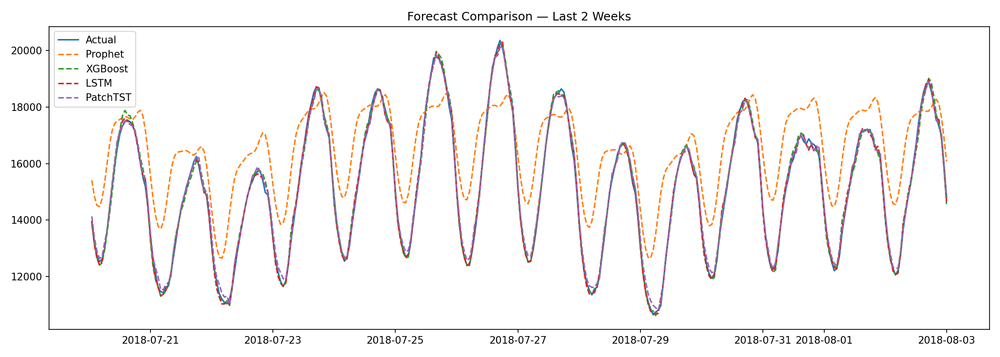
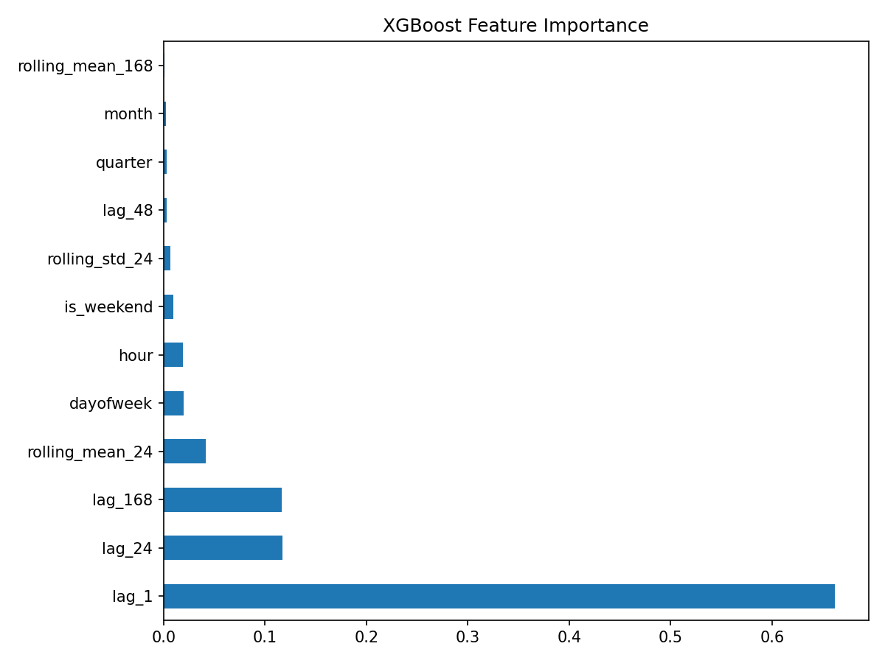

# Energy Consumption Forecasting

Hourly electricity demand forecasting on the AEP dataset (~121k hours, 2004–2018).
Compares four approaches — from classical decomposition to Transformer-based models —
and includes an interactive Streamlit dashboard.

## Results

| Model | MAE (MW) | MAPE |
|-------|----------|------|
| Prophet | 1535.93 | 10.33% |
| XGBoost + lag features | 133.58 | 0.85% |
| **LSTM + cyclic features** | **94.35** | **0.61%** |
| PatchTST | 141.22 | 0.94% |



## Models

**Prophet** — additive decomposition (trend + daily/weekly/yearly seasonality).
No memory of the immediate past; treats the series as a sum of smooth components.

**XGBoost** — gradient boosted trees on handcrafted lag features (1h, 24h, 48h, 168h),
rolling statistics, and calendar features. Early stopping uses a held-out validation
split from within the training set to avoid data leakage.



**LSTM** — two-layer LSTM with 8 input features: energy (scaled) + cyclic encodings
of hour, day-of-week, and month (sin/cos pairs) + is_weekend flag.
Cyclic encoding preserves circularity (hour 23 ≈ hour 0).

**PatchTST** — Transformer encoder on non-overlapping patches of the time series
(patch_len=16, stride=8 → 20 patch tokens). Pre-LayerNorm architecture,
learnable positional embeddings. Reduces attention complexity from O(L²) to O(P²).

## Discussion: why LSTM beats PatchTST here

The AEP series is dominated by **short-term autocorrelation**: the single best
predictor is the value one hour ago (lag_1), followed by lag_24 (same hour yesterday).
Electricity demand ramps up and down gradually with very little long-range dependency
beyond daily/weekly cycles.

LSTM's sequential inductive bias is well suited for this: it maintains a hidden state
that implicitly tracks the immediate past, giving lag_1 and lag_24 strong implicit weight
at every step.

PatchTST groups 16 consecutive hours into a single patch token. This aggregation
**dilutes the lag_1 signal** — the most recent hour is merged with the preceding 15.
The model must recover fine-grained recent information from a coarser representation,
an avoidable handicap on a dataset where recency dominates.

This result echoes **Zeng et al. (2022)** (*Are Transformers Effective for Time Series
Forecasting?*), which showed that on standard benchmarks a simple linear model can
outperform Transformer-based methods when the dominant pattern is a local linear trend.

### Computational complexity

| Model | Time | Space | Parallelisable |
|-------|------|-------|----------------|
| LSTM | O(L · d²) | O(L · d) | ❌ Sequential |
| Transformer (raw) | O(L² · d) | O(L²) | ✅ Parallel |
| PatchTST | O(P² · d) | O(P²) | ✅ Parallel |

L = sequence length, d = hidden size, P = number of patches (P ≪ L)

The **patching trick** reduces attention from O(L²) to O(P²) = O((L/p)²).
With patch_len=16 and L=168: raw attention needs 168² = 28,224 ops;
PatchTST needs only 20² = 400 — a 70× reduction.

Despite full GPU parallelism, PatchTST's larger parameter count (~330k vs ~80k)
and 50 epochs (vs 30 for LSTM) make total training time roughly 3× longer.

### When Transformers are the right choice

PatchTST and Transformer-based models outperform LSTMs when the signal is
**non-local** or **multi-source**:

1. **Long-range dependencies** — predicting demand 30 days ahead, where today's
   pattern must relate to the same weekday last month. Self-attention connects tokens
   720 steps apart directly; LSTM gradients vanish over that distance despite gating.

2. **Multivariate cross-series interactions** — forecasting 50 substations
   simultaneously, where load-shifting between areas creates non-local dependencies.
   Attention captures pairwise relationships across all series in one operation.

3. **Large-scale pretraining** — foundation models such as TimesFM (Google, 2024)
   and Chronos (Amazon, 2024) use Transformer backbones pretrained on millions of
   diverse series. Fine-tuned, they outperform task-specific LSTMs when labeled data
   is scarce.

**Rule of thumb**: if lag_1 and lag_24 explain most of the variance, use LSTM or
XGBoost with lag features. Reach for Transformers when the predictive signal lives
in patterns too long or too diffuse for a sequential model to capture.

## Project structure

```
energy_forecasting.ipynb   # training, evaluation, and model comparison
app.py                     # Streamlit dashboard
AEP_hourly.csv             # raw data (download from Kaggle, see below)
lstm_forecaster.pt         # saved LSTM weights
patchtst_forecaster.pt     # saved PatchTST weights
xgb_forecaster.pkl         # saved XGBoost model
energy_scaler.pkl          # StandardScaler for the energy column
```

## Dataset

[Hourly Energy Consumption](https://www.kaggle.com/datasets/robikscube/hourly-energy-consumption)
from Kaggle. Use `AEP_hourly.csv` (largest region, ~121k rows).
Place it in the project root before running the notebook.

## Setup

```bash
conda create -n torch_env python=3.11
conda activate torch_env
pip install torch torchvision torchaudio --index-url https://download.pytorch.org/whl/cu118
pip install numpy pandas scikit-learn xgboost prophet matplotlib tqdm joblib streamlit
```

## Run

**Notebook** — open `energy_forecasting.ipynb` and run all cells in order.
Trained models are saved automatically at the end.

**Dashboard** — after running the notebook at least once:

```bash
conda activate torch_env
python -m streamlit run app.py
```

Then open [http://localhost:8501](http://localhost:8501).

## References

- Nie et al. (2023) — *A Time Series is Worth 64 Words: Long-term Forecasting with Transformers* (PatchTST)
- Zeng et al. (2022) — *Are Transformers Effective for Time Series Forecasting?* (DLinear)
- Taylor & Letham (2018) — *Forecasting at Scale* (Prophet)
