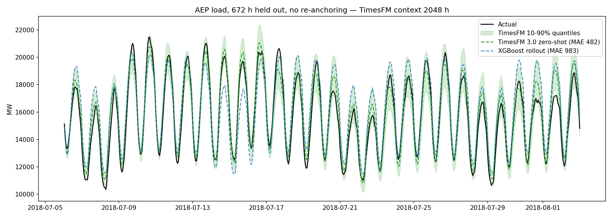

# TimesFM 3.0 zero-shot baseline

Pretrained 0.3B decoder-only patched transformer from Google Research, used here with
zero training. It emits the full forecast horizon directly in one forward call, with 9
quantiles per step, and needs no frequency indicator.

## Honest protocol — single direct 672 h forecast, no test data seen

| Model | MAE (MW) | MAPE | Note |
|---|---|---|---|
| **TimesFM 3.0 zero-shot** | **481.81** | **3.09%** | one call, 0.9 s, context 2048 h |
| XGBoost + lag (rollout) | 983.25 | 6.40% | best trained model |
| Prophet | 1535.93 | 10.33% | |
| LSTM + scheduled sampling | 2154.65 | 14.02% | |
| PatchTST | 2399.23 | 15.95% | |

10-90% quantile band: empirical coverage 88.5% over the 672 test hours (nominal 80%),
slightly conservative rather than over-confident.

## Teacher-forced 1-step (real history up to t, horizon 1, 672 calls batched)

| Model | MAE (MW) | MAPE |
|---|---|---|
| LSTM + cyclic | 94.35 | 0.61% |
| **TimesFM 3.0 zero-shot** | **94.03** | **0.61%** |
| XGBoost + lag | 133.58 | 0.85% |
| PatchTST | 141.22 | 0.94% |
| Prophet | 1535.93 | 10.33% |

## Context-length ablation (honest protocol)

| Context (h) | MAE | MAPE |
|---|---|---|
| 512 | 812.41 | 5.14% |
| 1024 | 518.00 | 3.28% |
| **2048** | **481.81** | **3.09%** |
| 4096 | 487.78 | 3.14% |
| 8192 | 524.73 | 3.37% |
| 16384 | 535.78 | 3.45% |

Sweet spot ~2-4k h (3-6 months). Below 1k the model lacks a full weekly/seasonal picture,
above 8k the extra history is mostly other seasons and mildly hurts a July-August forecast.



## Reading

- The honest gap (482 vs 983) is the exposure-bias story from the main README, seen from
  the other side: TimesFM emits the whole horizon in patches of 64 and never feeds its own
  point estimate back as a lag feature, so it has no compounding error to fight.
- Teacher-forced parity with the LSTM (94.0 vs 94.4) says the pretrained model already
  matches a model trained for 40 epochs on this exact series, without seeing it.
- Caveat: one 4-week window in summer 2018. A rolling-origin backtest over several windows
  is the obvious next step before calling the ranking robust.
- Weights are under the TimesFM Non-Commercial License v1.0, fine for a portfolio, not for
  production.

## How to run

```bash
pip install "timesfm[torch]"
```

```
C:\Users\gabri\miniconda3\envs\torch_env\python.exe timesfm\run_timesfm.py
```

Run from the repo root. Writes `results.csv`, `timesfm_pred.csv`, and
`forecast_timesfm.png` into `timesfm/`. Total runtime is about 30 s on an RTX 4070 Laptop
(no training, checkpoint download on first run).

## License

TimesFM 3.0 weights are distributed under the TimesFM Non-Commercial License v1.0
(the code itself is Apache-2.0). Portfolio and non-production use only.

## Files

- `run_timesfm.py` — honest, teacher-forced, and context-ablation protocols, plus the plot
- `results.csv` — metrics for all three protocols
- `timesfm_pred.csv` — per-hour predictions, quantiles, and actuals for the held-out window
- `forecast_timesfm.png` — forecast vs actual plot
- `reports/` — phase 1 (install/API notes) and phase 2 (experiment results) write-ups
